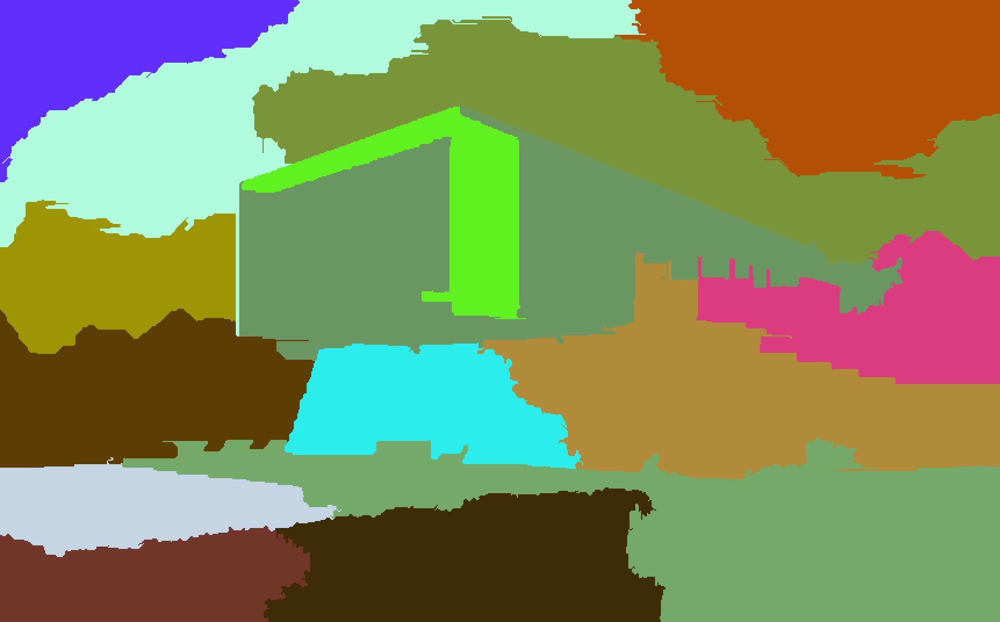

# Image Segmentation 
Implements the [Felzenszwalb-Huttenlocher segmentation](http://people.cs.uchicago.edu/~pff/papers/seg-ijcv.pdf) algorithm to segment images.

Note: Requires Eigen 3.2.4 and ImageMagick and assumes they are in /usr/local/Cellar/eigen/3.2.4/include/eigen3/ and /usr/local/Cellar/imagemagick/6.9.2-3/include/ImageMagick-6
